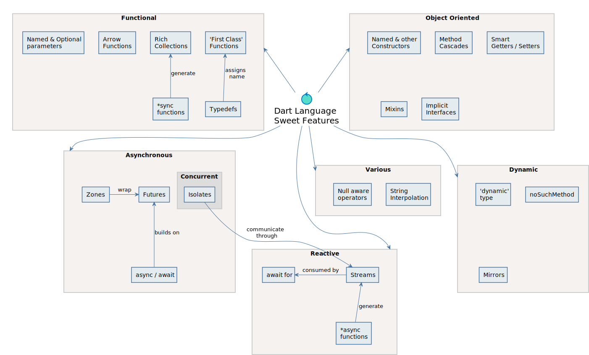
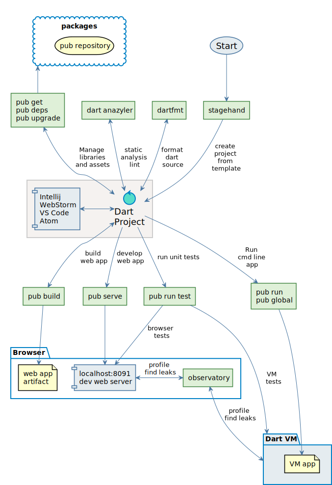
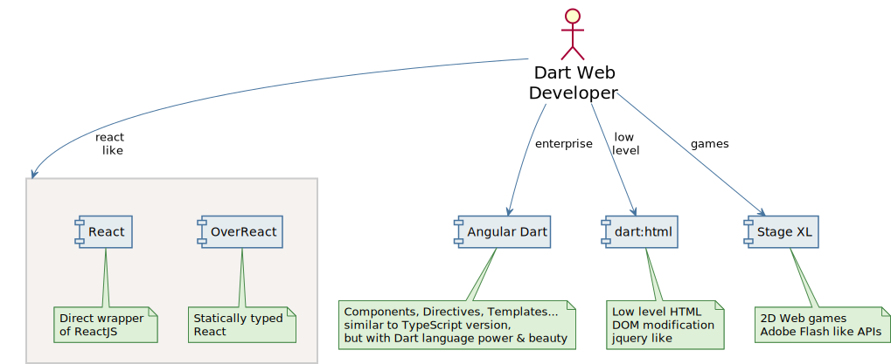
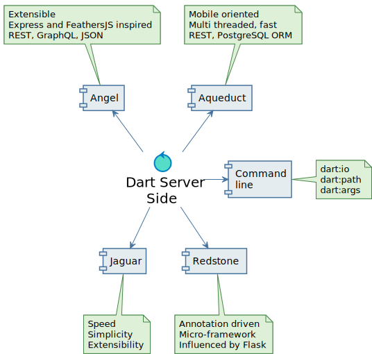

## Dart Platform Diagrams
 * Collections of diagrams trying to describe awesome Dart platform for Mind Map oriented people
 * Diagram nodes are clickable, will bring you to related part of Dart documentation 
 * Diagrams are text source based for easy modifications and embedding in your wiki, confluence, presentation etc 
 * Diagrams are generated from text sources using [PlantUML](http://plantuml.com) tool, [Intellij PlantUML plugin](https://plugins.jetbrains.com/plugin/7017-plantuml-integration) was used for diagram creation
 * Don't hesitate to contribute, reasonable pull requests will be accepted

### Deployment Overview
Dart code runs or is deployable to broad range of target environments, from mobile across web to server and even 
to new Fuchsia OS.

### Language Beauties
Dart language sugars can bring joy to any development flavour

### Web and VM Development Workflow
Dart platform contains rich set of tools for productive development

### Web frameworks
Web developer in Dart can choose from several well supported frameworks which generally mirror JS world

### Server side
On backend side, Dart faces tough and numerous competition. However, Dart server frameworks feel slick, elegant, comfortable
